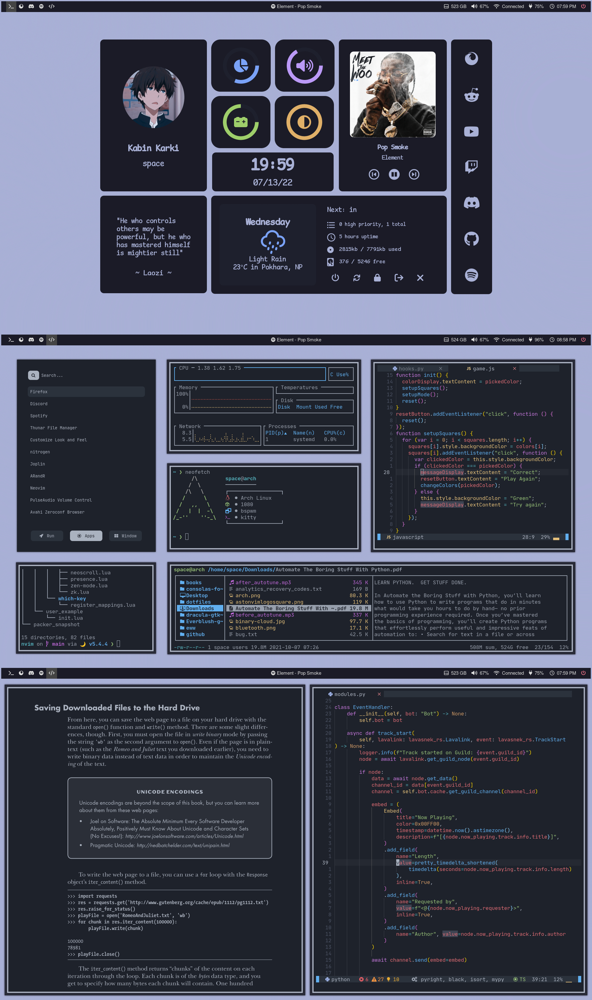

<div align="center">


<br>
</div>

## 🌿 Information



- **Operating System:** [arch](https://archlinux.org/)
- **Window Manager:** [bspwm](https://github.com/baskerville/bspwm)
- **Compositor:** [picom](https://github.com/yshui/picom)
- **Terminal:** [kitty](https://github.com/kovidgoyal/kitty)
- **Shell:** [bash](https://www.gnu.org/software/bash/)
- **Panel:** [eww](https://github.com/elkowar/eww)
- **Text Editor:** [neovim](https://github.com/neovim/neovim)
- **Neovim Config**: [astronvim](https://github.com/AstroNvim/AstroNvim)
- **Notification Manager:** [dunst](https://github.com/dunst-project/dunst)
- **File Manager:** [ranger](https://github.com/ranger/ranger)
- **Application Launcher:** [rofi](https://github.com/davatorium/rofi)

## 📦 Setup

#### Files are structured to create symlinks using [stow](https://www.gnu.org/software/stow/)

#### Clone the repo

```sh
git clone https://github.com/kabinspace/dotfiles
```

#### Create symlinks

```sh
cd dotfiles && stow */
```

## ⭐ Credits

- Rofi config from [adi1090x](https://github.com/adi1090x)
- Dashboard config from [rxyhn](https://github.com/rxyhn)
